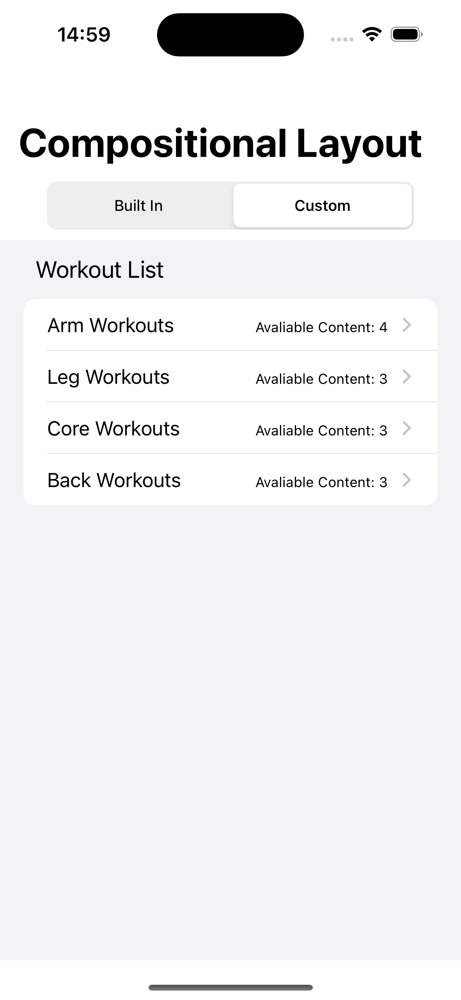

#Compositional Layout Demo

### Practice of modern concepts such as DiffableDataSource and Compositional Layout.

in progres... 
to-do: Detail views for the cells. 
any advice or comments are appreciated.

 <pre/>

